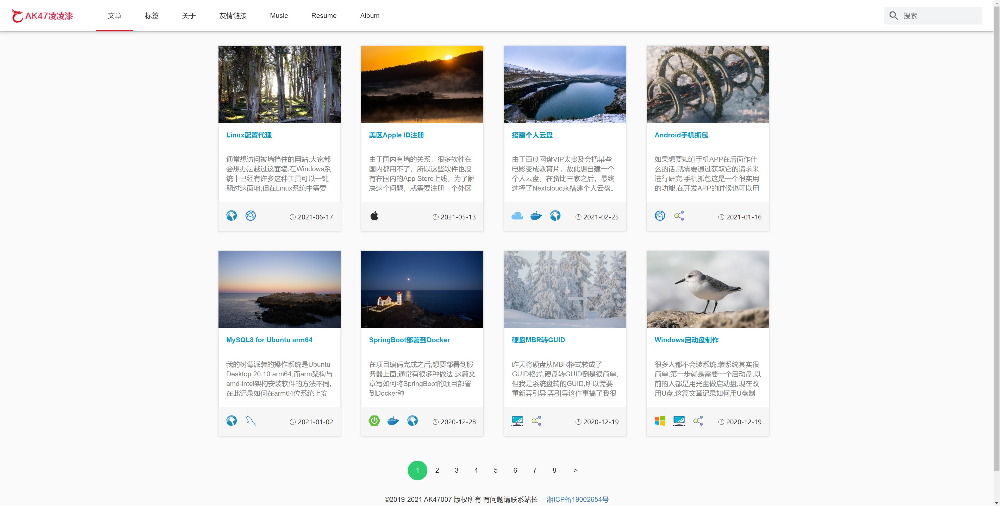
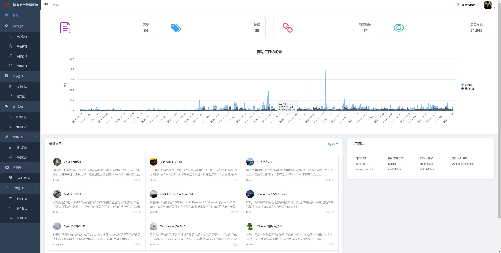

# 个人博客平台

## 预览

**前台**

**后台**

## 项目简介

个人博客平台，开发的初衷就是造出一款能满足自己要求的博客写作平台，本项目的业务设计也都是只考虑满足个人的需求，本项目包括前台跟后台，前台主要用于展示写作的文章，后台主要用于写作等。

## 为什么写这么个东西？

* 一开始是为了装逼，后来就慢慢想把自己的东西给做好。
* 定制化，其他的博客平台的哪个地方你用的不爽你没有办法，但自己的博客平台想怎么改就怎么改。
* 数据私密性，你在其他博客平台写了篇文章，审核不通过就被人删了，有一个自己的博客平台，数据库都是自己的，想写什么写什么，也不会有人删你的文章。

# 前台

* 测试预览地址: https://blog.ak47007.com
* 博客预览地址: https://www.ak47007.com

# 后台

预览地址: 正在部署中

